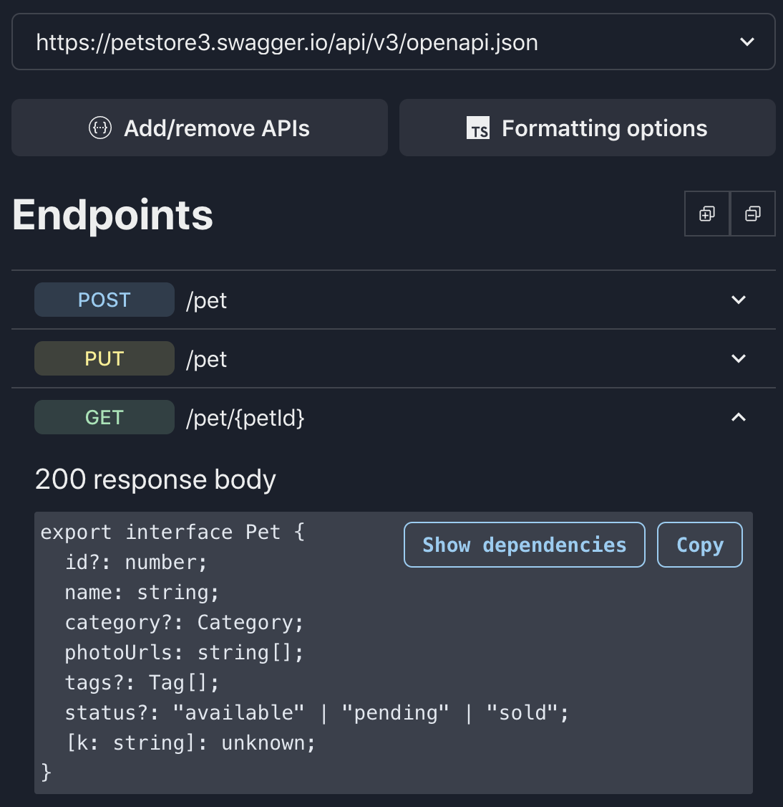

# Typescript API Docs

[https://tsapidocs.com](https://tsapidocs.com)

A browser-based UI for automatically generating REST API typescript definitions.

## Introduction

Typescript definitions can be instantly generated and viewed for any API which has an OpenAPI (formerly known as Swagger) specification. These definitions describe the request and response bodies for each route.

Definitions are organized by both endpoint and by model. They can be viewed and exported either as standalone definitions or with dependencies included.

The list of OpenAPI documents available for selection can be updated via "Add/remove APIs", and the typescript formatting can be customized via "Formatting options".

To share particular definitions with others, simply copy and paste the URL. It captures the selected document and endpoint/model as query parameters.

## How it works

_Everything_ occurs client-side, which means it will work for any OpenAPI document that you have access to - even if it's not publicly accessible.

Upon selecting an API, the document is loaded and then parsed/dereferenced using [swagger-parser](https://github.com/APIDevTools/swagger-parser). The request and response schemas are then extracted, and [json-schema-to-typescript](https://github.com/bcherny/json-schema-to-typescript) is used to convert them into typescript definitions.
